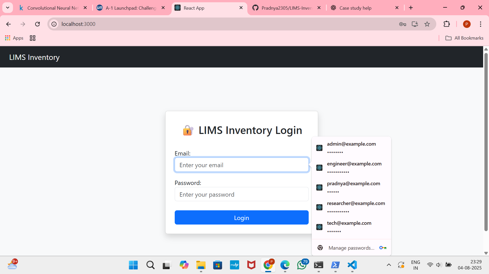
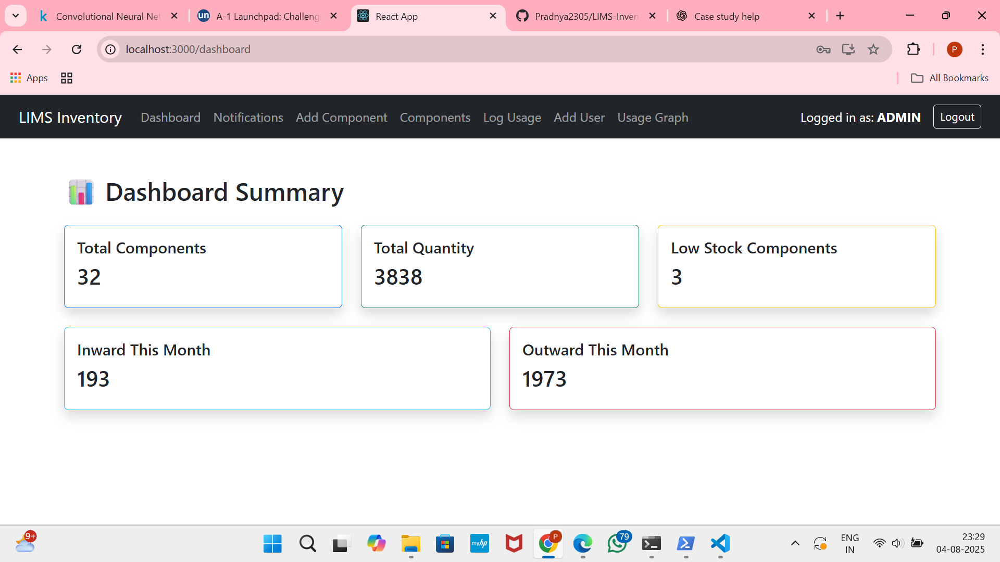
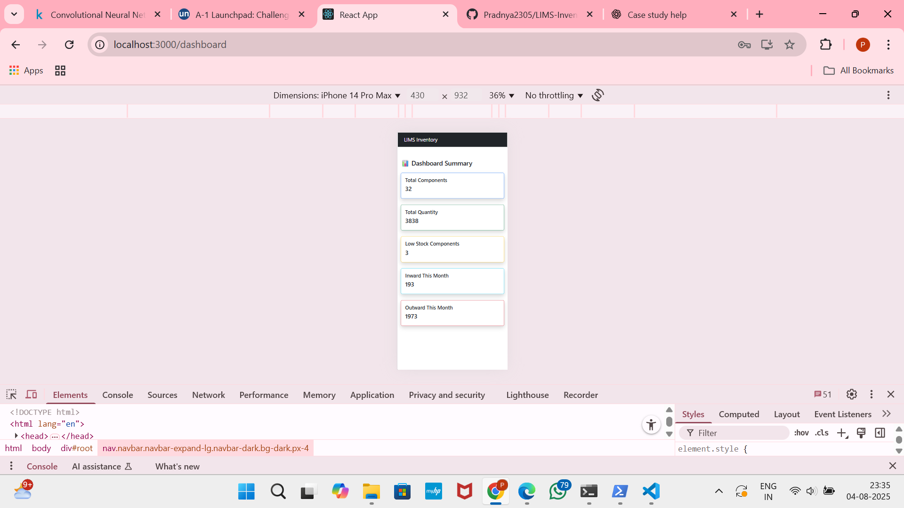
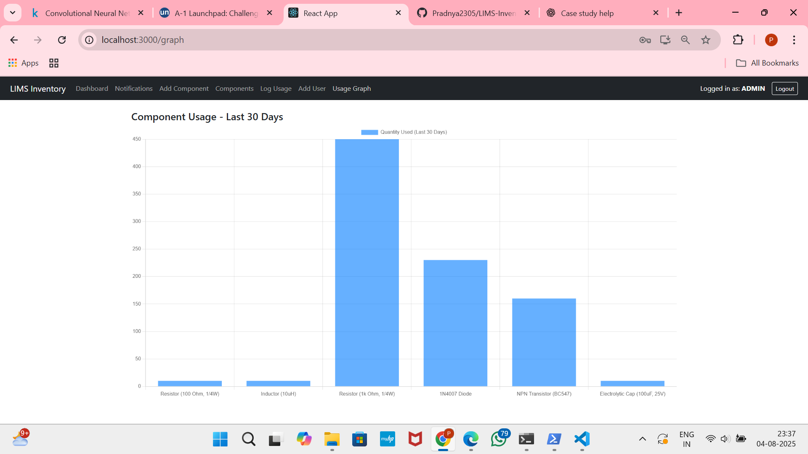

# 🔬 LIMS Inventory Management System

An AI-assisted, role-based **Laboratory Inventory Management System** for managing electronic components in labs. It enables different stakeholders to perform component movements, view analytics, and monitor stock effectively.

---

## 📁 Project Structure

```
LIMS-Inventory-System/
├── backend/              # Express.js API + MongoDB Models
│   ├── controllers/
│   ├── models/
│   ├── routes/
│   ├── .env              # ✅ Your secrets (NOT pushed)
│   └── server.js
├── lims-frontend/        # React frontend
│   ├── src/
│   ├── public/
│   └── README.md         # Default CRA README
└── README.md             # ✅ This file
```

---

## 🌐 Project Overview

This system handles lab inventory including real-time stock management, component tracking, and usage analytics. It includes:

* JWT authentication and role-based access
* Inward/outward component movements
* Low stock and old stock alerts
* 30-day usage graph (for Admin)
* Mobile-responsive interface

---

## 🛠️ Setup Instructions

### Backend

```bash
cd backend
npm install
```

Create a `.env` file in `backend/` with:

```
MONGODB_URI=mongodb://localhost:27017/lims-inventory
JWT_SECRET=your_jwt_secret
PORT=5000
```

Run the backend:

```bash
npm start
```

### Frontend

```bash
cd lims-frontend
npm install
npm start
```

---

## 🔐 Role-Based Access

| Role           | Pages/Features                                      |
| -------------- | --------------------------------------------------- |
| Admin          | Dashboard, Notifications, RegisterUser, Usage Graph |
| Lab Technician | Inward Component Movements                          |
| Researcher     | View/Search Inventory                               |
| Engineer       | Outward Component Movements                         |

Use Postman or UI for user registration/login. JWT is used to manage access.

---

## ✨ Features Implemented

* Role-based login & page protection
* Add/remove component stock
* Notifications for low/old stock
* Graph of outward usage (30 days)
* Responsive layout for desktop & mobile
* Voice alerts (optional)
* Protected API with token

---

## 📊 Usage Analytics Graph

Admin can view a bar chart of total outward component usage in the last 30 days using `Chart.js`.

---

## 🧾 Sample Component Fields

| Field                | Example                  |
| -------------------- | ------------------------ |
| name                 | Resistor (100 Ohm, 1/4W) |
| category             | Resistors                |
| manufacturer         | Generic                  |
| quantity             | 500                      |
| location             | R-Shelf-A1               |
| unitPrice            | 0.50                     |
| criticalLowThreshold | 100                      |

---

## 🖥️ Screenshots

*Add relevant screenshots here (login, dashboard, mobile view, graph, etc.)*


 


---

## 📦 Technologies Used

* React.js + Bootstrap (frontend)
* Node.js + Express (backend)
* MongoDB (database)
* JWT (auth)
* Chart.js (graphs)

---

## 🧾 .gitignore

`.env` is excluded using `.gitignore`:

```
node_modules/
.env
```

---

## 🚀 Deployment

Instructions to deploy using `npm run build` for frontend and host backend with Node.js or any cloud server.

---

## 🛠️ Known Limitations / Future Scope

* Add pagination/search filter for components
* Support for CSV import/export
* Multi-lab support with sub-admins
* Predictive analytics for component demand

---


# Getting Started with Create React App

This project was bootstrapped with [Create React App](https://github.com/facebook/create-react-app).

## Available Scripts

In the project directory, you can run:

### `npm start`

Runs the app in the development mode.\
Open [http://localhost:3000](http://localhost:3000) to view it in your browser.

The page will reload when you make changes.\
You may also see any lint errors in the console.

### `npm test`

Launches the test runner in the interactive watch mode.\
See the section about [running tests](https://facebook.github.io/create-react-app/docs/running-tests) for more information.

### `npm run build`

Builds the app for production to the `build` folder.\
It correctly bundles React in production mode and optimizes the build for the best performance.

The build is minified and the filenames include the hashes.\
Your app is ready to be deployed!

See the section about [deployment](https://facebook.github.io/create-react-app/docs/deployment) for more information.

### `npm run eject`

**Note: this is a one-way operation. Once you `eject`, you can't go back!**

If you aren't satisfied with the build tool and configuration choices, you can `eject` at any time. This command will remove the single build dependency from your project.

Instead, it will copy all the configuration files and the transitive dependencies (webpack, Babel, ESLint, etc) right into your project so you have full control over them. All of the commands except `eject` will still work, but they will point to the copied scripts so you can tweak them. At this point you're on your own.

You don't have to ever use `eject`. The curated feature set is suitable for small and middle deployments, and you shouldn't feel obligated to use this feature. However we understand that this tool wouldn't be useful if you couldn't customize it when you are ready for it.

## Learn More

You can learn more in the [Create React App documentation](https://facebook.github.io/create-react-app/docs/getting-started).

To learn React, check out the [React documentation](https://reactjs.org/).

### Code Splitting

This section has moved here: [https://facebook.github.io/create-react-app/docs/code-splitting](https://facebook.github.io/create-react-app/docs/code-splitting)

### Analyzing the Bundle Size

This section has moved here: [https://facebook.github.io/create-react-app/docs/analyzing-the-bundle-size](https://facebook.github.io/create-react-app/docs/analyzing-the-bundle-size)

### Making a Progressive Web App

This section has moved here: [https://facebook.github.io/create-react-app/docs/making-a-progressive-web-app](https://facebook.github.io/create-react-app/docs/making-a-progressive-web-app)

### Advanced Configuration

This section has moved here: [https://facebook.github.io/create-react-app/docs/advanced-configuration](https://facebook.github.io/create-react-app/docs/advanced-configuration)

### Deployment

This section has moved here: [https://facebook.github.io/create-react-app/docs/deployment](https://facebook.github.io/create-react-app/docs/deployment)

### `npm run build` fails to minify

This section has moved here: [https://facebook.github.io/create-react-app/docs/troubleshooting#npm-run-build-fails-to-minify](https://facebook.github.io/create-react-app/docs/troubleshooting#npm-run-build-fails-to-minify)
